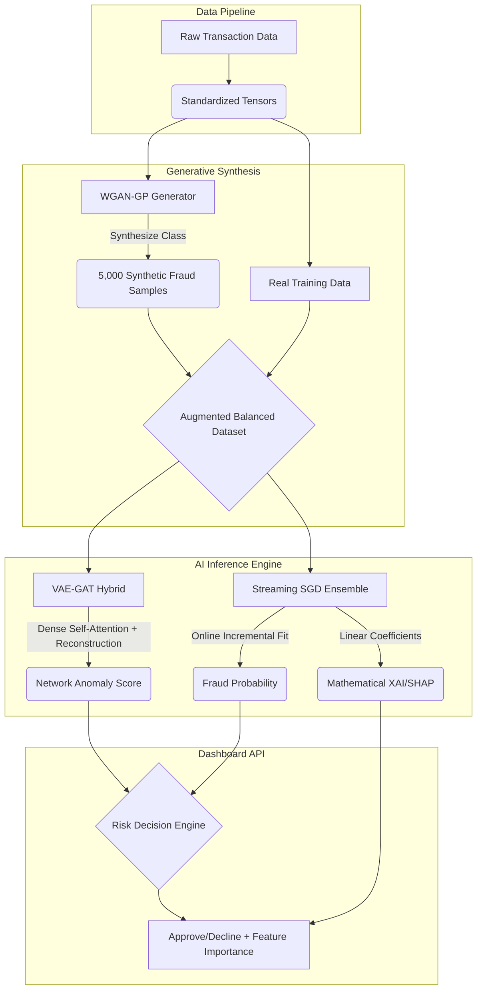

# CreditCardFraudRnD: Hybrid GenAI Fraud Detection System

## Overview
This repository contains a state-of-the-art, real-time fraud detection engine designed for modern fintech environments. It implements a hybrid architecture combining unsupervised deep learning, adversarial generation, and continuous streaming machine learning to protect against sophisticated fraud vectors like synthetic identities, VPN-based anomalies, and velocity attacks.

The system is built based on the research principles of sub-second inference, explainable AI (XAI), and a robust, automated risk-tiering methodology to ensure regulatory compliance and operational precision.

---

## 🚦 3-Tier Risk Decision Engine
Aligned with the core research proposal, the inference engine maps the VAE-GAT reconstruction thresholds and ensemble probabilities into three distinct operational tiers:

- **Tier 1: Critical Risk [🚨 Auto-Decline]**
  - **Condition:** Ensemble Probability > 40% OR VAE Anomaly > 40% (Normative p95 breach).
  - **Action:** Transaction instantly declined. Flags standard fraud, synthetic identities, velocity attacks, and VPN anomalies.
- **Tier 2: Moderate Risk / High Value [📞 Bank Verification Required]**
  - **Condition:** Risk Score between 15% and 40% **OR** Transaction Amount > $5,000.
  - **Action:** Transaction suspended pending manual cardholder verification call, preventing large fund extraction.
- **Tier 3: Normal Behavior [✅ Auto-Approve]**
  - **Condition:** Baseline baseline Risk Score < 15% and Amount < $5,000.
  - **Action:** Seamlessly approved to ensure low false-positive friction.

---

## 🏗️ Core Architecture



### 1. Hybrid Intelligence Engine
- **Generative Anomaly Modeling (VAE-GAT)**: A Variational Autoencoder equipped with a PyTorch Multihead Attention layer learns the latent distribution of legitimate transactions while simultaneously capturing relational dynamics in the mini-batch (Graph Attention). It flags anomalies based on reconstruction error.
- **Adversarial Synthesis (WGAN-GP)**: A Wasserstein GAN with Gradient Penalty synthesizes 5,000 highly realistic synthetic fraud transactions, balancing the dataset before training the ensemble.
- **Continuous Learning Ensemble**: Utilizing a streaming SGD-based classifier (Scikit-Learn) that adapts to **Concept Drift** in real-time. Unlike traditional batch models, this system learns incrementally.

### 2. Explainable AI (XAI)
- **SHAP Integration**: Every decision is accompanied by a feature importance breakdown. The system explains *why* a transaction was flagged (e.g., due to IP Address risk or high Velocity), ensuring transparency for risk officers.

### 3. Real-Time Dashboard
- **White Glassmorphism UI**: A professional, enterprise-grade dashboard provided via FastAPI and Vanilla JS.
- **Live Monitoring**: Visualizes risk scores, VAE reconstruction errors, and continuous learning ROC-AUC metrics.

---

## 🚀 Getting Started

### Prerequisites
- Python 3.9+
- Git

### 🚀 One-Click Setup and Execution (Windows)

For a seamless experience, use the provided clickable batch files:

1.  **Install/Setup**:
    - Double-click `setup.bat`.
    - This will create a virtual environment and install all required libraries automatically.
2.  **Run the Project**:
    - Double-click `run.bat`.
    - This will start the Backend server in a new window and automatically open the Dashboard in your default browser.
3.  **Reset Data (Optional)**:
    - Double-click `reset_data.bat` if you wish to re-generate the sandbox card profiles.

---

### Alternative: Manual Terminal Installation
*Use these steps if you prefer the terminal or are on a non-Windows OS.*

1. **Clone the Repository**:
   ```ps
   git clone https://github.com/MevrickNeal/CreditCardFraudRnD.git
   cd CreditCardFraudRnD
   ```

2. **Install Dependencies**:
   ```ps
   pip install -r requirements.txt
   ```

3. **Running the System**:
   - **Start Server**: `python -m uvicorn backend.app:app --host 0.0.0.0 --port 8000`
   - **Open Dashboard**: Navigate to `http://localhost:8000` in your web browser. (The backend will automatically serve the frontend).

---

## 📂 Project Structure
- `models/`: PyTorch definitions and trained artifacts.
- `backend/`: FastAPI application and inference logic.
- `frontend/`: Real-time dashboard (HTML/JS).
- `data_pipeline.py`: ETL and preprocessing logic for IEEE-CIS data.
- `train_engine.py`: Unified training implementation for GenAI & Ensemble models.
- `generate_profiles.py`: Simulation logic for various attack vectors (VPN, Synthetic, etc.).

## 🛡️ Target Threats
- **Synthetic Identity Fraud**: Detection via VAE + WGAN-GP modeling.
- **Account Takeover (ATO)**: Identified via IP/Device fingerprint anomalies.
- **Velocity Attacks**: Blocked via streaming real-time feature engineering.
- **Location Spoofing**: VPN detection through network-layer risk modeling.